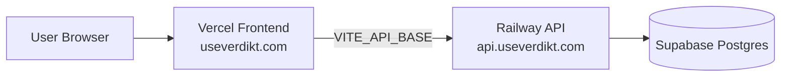

<p align="center">
  
</p>

<h1 align="center">Verdikt</h1>

<p align="center">
Release intelligence for AI product teams: certify releases against thresholds, govern overrides, and keep an immutable audit trail.
</p>

<p align="center">
  <a href="https://useverdikt.com"></a>
  
  
  
  
</p>

## Live Environment

- App: [https://useverdikt.com](https://useverdikt.com)
- API base (public route): `https://api.useverdikt.com` (recommended custom domain)
- Health endpoints: `/health` and `/health/ready`

## Why Verdikt

Shipping AI features safely is hard when release signals are scattered across tools and teams.
Verdikt gives engineering, product, and compliance stakeholders a shared decision layer:

- Define release thresholds for critical signals
- Compute pass/fail verdicts with explainable outputs
- Govern overrides with explicit rationale and role-based control
- Preserve immutable audit records for accountability and incident review

## Stack

- Frontend: React + Vite (`frontend/`)
- Backend: Express (`backend/`)
- Database: PostgreSQL (Supabase)
- Hosting: Vercel (frontend) + Railway (backend)
- DNS/Registrar: one.com (nameservers delegated to Vercel)

## Architecture



## Product Flow (MVP)

1. User authenticates to a workspace.
2. Team creates a release candidate.
3. Signals are ingested and normalised.
4. Verdict engine evaluates thresholds and computes certification state.
5. Authorised users can submit overrides when risk context justifies it.
6. Every decision and mutation is recorded in the audit trail.

## Repository Layout

| Path | Purpose |
| --- | --- |
| `frontend/` | React SPA, Vitest unit tests, Playwright e2e |
| `backend/` | Express API, auth, webhooks, PostgreSQL migrations |
| `shared/` | Shared config/constants used by backend + frontend |
| `supabase/` | Optional local Supabase tooling/config |

## Quick Start (Local)

### 1) Configure backend env

Copy [`backend/.env.example`](backend/.env.example) to `backend/.env` and set at minimum:

- `DATABASE_URL` (PostgreSQL)

See [`backend/README.md`](backend/README.md) for full production/security settings.

### 2) Install and run full stack

From repo root:

```bash
npm install --prefix backend
npm install --prefix frontend
npm run dev
```

This starts:

- API: `http://127.0.0.1:8787`
- SPA: `http://127.0.0.1:5174` (with `/api` + `/health` proxied to backend)

### Run services separately

Backend only:

```bash
cd backend && npm install && npm start
```

Frontend only:

```bash
cd frontend && npm install && npm run dev
```

## Testing

| Scope | Command |
| --- | --- |
| Backend tests | `npm run test:backend` or `cd backend && npm test` |
| Frontend unit tests | `npm run test:frontend` or `cd frontend && npm test` |
| E2E (Playwright) | `npm run test:e2e` or `cd frontend && npm run test:e2e` |
| All tests | `npm test` |

For e2e on a fresh machine, run `npx playwright install` once.

## Production Configuration

### Vercel (frontend)

- Build target: `frontend/`
- Required env:
  - `VITE_API_BASE=https://api.useverdikt.com`
  - `VITE_SUPABASE_URL=...`
  - `VITE_SUPABASE_ANON_KEY=...`

### Railway (backend)

- Service root: `backend/`
- Build/start:
  - install: `npm ci`
  - build: no-op (`echo 'No build step (Node backend)'`)
  - start: `npm start`
- Required env (core):
  - `DATABASE_URL` (Supabase pooler URL)
  - `DATABASE_SSL=1`
  - `CORS_ORIGINS=https://useverdikt.com`
  - `TRUST_PROXY=1`
  - `JWT_SECRET`, `WEBHOOK_SECRET`, `ENCRYPTION_MASTER_KEY`
  - `SUPABASE_JWT_SECRET`

### Supabase (database)

- Use PostgreSQL pooler credentials for Railway connectivity.
- Backend runs SQL migrations from `backend/migrations/postgres/` at startup.

## Operational Checks

After each deploy:

```bash
curl -i "https://api.useverdikt.com/health"
curl -i "https://api.useverdikt.com/health/ready"
```

Expected:

- `/health` => `200` with `{"ok":true,...}`
- `/health/ready` => `200` with database check `true`

## Common Gotchas

- `Cannot GET /` on Railway domain is normal (API service, not a website).
- `DEPLOYMENT_NOT_FOUND` on `useverdikt.com` means Vercel had no active production deployment.
- Supabase RLS warnings are security hardening items, not usually runtime blockers for Railway-managed SQL access.

## Security Notes

- Backend refuses to start in production-like mode if critical secrets are weak/missing.
- Session handling uses HttpOnly cookies + CSRF protections.
- Encryption-at-rest is enforced for sensitive integration secrets.
- For Supabase, prefer enabling RLS on publicly exposed schemas/tables.

## Documentation

- Backend deep dive: [`backend/README.md`](backend/README.md)
- Frontend source: [`frontend/`](frontend/)
- Supabase local tooling: [`supabase/README.md`](supabase/README.md)

## Contributing

- Fork or branch from `main`, then create a focused feature/fix branch.
- Keep PRs small and reviewable; include test evidence for behaviour changes.
- Run `npm test` from repo root before opening a PR.
- Never commit secrets; `.env` files and service keys stay local/platform-managed.

## Roadmap (Near-Term)

- Add release notes automation.
- Add product screenshots and short demo GIF.
- Add one-command production smoke test script.
- Publish architecture and security docs for external reviewers.
